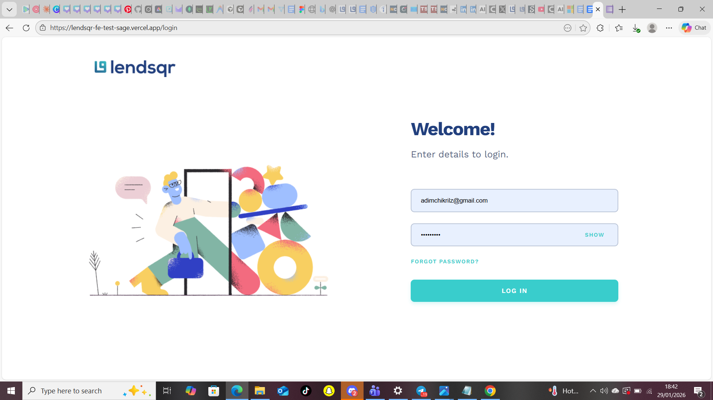
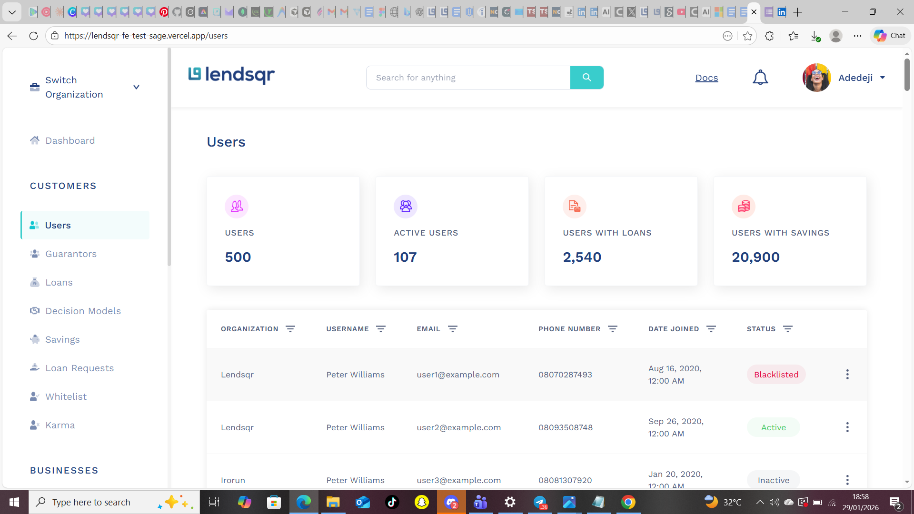
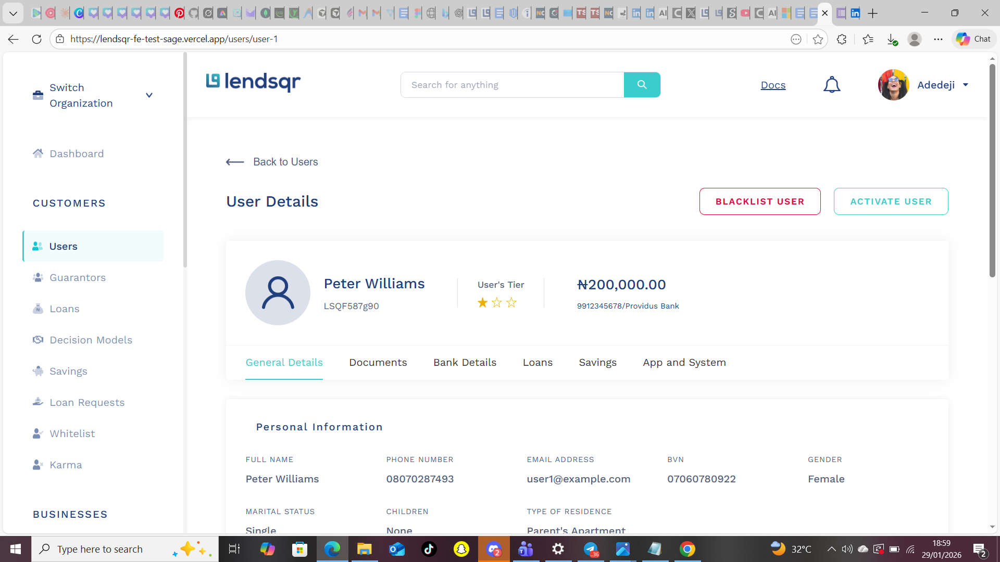

# Lendsqr Frontend Engineering Assessment

A pixel-perfect admin dashboard for managing users, built with React, TypeScript, and SCSS.





## Live Demo

**Deployed Application:** [Click here](https://lendsqr-fe-test-sage.vercel.app/)

**Repository:** [Click here](https://github.com/adimchikrilz/lendsqr-fe-test)

## Table of Contents

- [Overview](#overview)
- [Features](#features)
- [Tech Stack](#tech-stack)
- [Getting Started](#getting-started)
- [Project Structure](#project-structure)
- [Testing](#testing)
- [Deployment](#deployment)
- [Design Decisions](#design-decisions)

## Overview

This project is a frontend assessment submission for Lendsqr, implementing a comprehensive admin dashboard with user management capabilities. The application includes:

- **Login Page** - Secure authentication interface
- **Users Dashboard** - Overview with statistics and user table
- **User Details** - Detailed view of individual user information
- **Responsive Design** - Optimized for desktop, tablet, and mobile devices

## Features

### Core Functionality
- **User Authentication** - Login page with form validation
- **User Management** - View, filter, and manage 500+ users
- **Advanced Filtering** - Filter users by organization, status, date, etc.
- **Pagination** - Navigate through large datasets efficiently
- **User Details** - Comprehensive user profile view
- **Local Storage** - Persist user data across sessions
- **Responsive Design** - Works seamlessly on all devices

### UI/UX Features
- **Pixel-Perfect Design** - Matches Figma specifications exactly
- **Mobile Optimized** - Touch-friendly interfaces, no zoom issues
- **Fast Performance** - Optimized rendering and data handling
- **Smooth Animations** - Polished transitions and interactions
- **Accessible** - WCAG compliant, keyboard navigation

## Tech Stack

### Core Technologies
- **React 18** - Modern UI library with hooks
- **TypeScript** - Type-safe JavaScript
- **SCSS** - Advanced CSS with variables and nesting
- **Vite** - Next-generation frontend tooling

### Additional Libraries
- **React Router DOM** - Client-side routing
- **Vitest** - Unit testing framework
- **Testing Library** - React component testing

### Why These Technologies?

#### React
- **Component Reusability** - DRY principle, maintainable codebase
- **Virtual DOM** - Efficient rendering and performance
- **Large Ecosystem** - Extensive community support and libraries
- **Industry Standard** - Most popular frontend framework

#### TypeScript
- **Type Safety** - Catch errors during development, not production
- **Better IDE Support** - Autocomplete, refactoring, and IntelliSense
- **Self-Documenting** - Types serve as inline documentation
- **Scalability** - Easier to maintain and scale large codebases

#### SCSS
- **Variables & Nesting** - More maintainable CSS
- **Mixins & Functions** - Reusable styling patterns
- **Better Organization** - Modular stylesheets
- **Assessment Requirement** - Specified in the brief

## Getting Started

### Prerequisites
- Node.js (v16 or higher)
- npm or yarn package manager

### Installation

1. **Clone the repository**
   ```bash
   git clone https://github.com/adimchikrilz/lendsqr-fe-test
   ```

2. **Install dependencies**
   ```bash
   npm install
   ```

3. **Start development server**
   ```bash
   npm run dev
   ```

4. **Open browser**
   ```
   Navigate to http://localhost:5173
   ```

### Available Scripts

```bash
npm run dev          # Start development server
npm run build        # Build for production
npm run preview      # Preview production build
npm run test         # Run unit tests
npm run test:ui      # Run tests with UI
npm run lint         # Lint code
```

## Project Structure

```
lendsqr-fe-test/
├── public/
│   └── assets/           # Images and icons
├── src/
│   ├── components/       # Reusable components
│   │   ├── Header/
│   │   ├── Sidebar/
│   │   ├── StatsCard/
│   │   └── UsersTable/
│   ├── pages/           # Page components
│   │   ├── Login/
│   │   ├── Users/
│   │   └── UserDetails/
│   ├── App.tsx          # Root component
│   ├── main.tsx         # Entry point
│   └── index.scss       # Global styles
├── package.json
├── tsconfig.json
├── vite.config.ts
└── README.md
```

## Testing

### Run Tests
```bash
npm run test
```

### Test Coverage
- Login form validation
- Password visibility toggle
- Form submission
- Component rendering
- User interactions

### Testing Approach
- **Unit Tests** - Individual component functionality
- **Integration Tests** - Component interactions
- **Accessibility Tests** - WCAG compliance

## Deployment

### Vercel (Recommended)

1. **Install Vercel CLI**
   ```bash
   npm install -g vercel
   ```

2. **Deploy**
   ```bash
   vercel
   ```

3. **Follow prompts** to configure and deploy

### Alternative: Netlify

1. **Build the project**
   ```bash
   npm run build
   ```

2. **Deploy the `dist` folder** to Netlify

### Alternative: GitHub Pages

1. **Install gh-pages**
   ```bash
   npm install -D gh-pages
   ```

2. **Add to package.json**
   ```json
   "scripts": {
     "deploy": "gh-pages -d dist"
   }
   ```

3. **Deploy**
   ```bash
   npm run build
   npm run deploy
   ```

## Design Decisions

### Component Architecture
- **Atomic Design** - Organized from atoms to pages
- **Separation of Concerns** - Logic, styling, and markup separated
- **Reusability** - Components designed for multiple contexts

### State Management
- **React Hooks** - useState, useEffect for local state
- **URL State** - React Router for navigation state
- **Local Storage** - Persistent data across sessions

### Styling Strategy
- **SCSS Modules** - Scoped styles per component
- **Mobile-First** - Responsive design from smallest screens up
- **BEM-like Naming** - Consistent, readable class names

### Performance Optimizations
- **Code Splitting** - Route-based lazy loading (future enhancement)
- **Memoization** - Prevent unnecessary re-renders
- **Optimized Images** - SVG for icons, optimized PNGs

## Responsive Design

### Breakpoints
- **Mobile:** < 768px
- **Tablet:** 768px - 1024px
- **Desktop:** > 1024px

### Mobile Optimizations
- Touch-friendly buttons (44px minimum)
- Horizontal scrolling for wide tables
- Stacked layouts for better readability
- No iOS zoom on input focus (16px font-size)

## Security Considerations

- **Input Validation** - Email and password validation
- **XSS Prevention** - React's built-in escaping
- **Type Safety** - TypeScript prevents many runtime errors
- **No Sensitive Data** - Mock data only, no real user information

## Known Issues / Future Enhancements

- [ ] API integration (currently using mock data)
- [ ] Advanced search functionality
- [ ] Export to CSV/PDF
- [ ] Dark mode toggle
- [ ] Multi-language support
- [ ] Real-time updates

## Author

**Adimchimnobi Igwenagu**
- GitHub: [Click Here](https://github.com/adimchikrilz/lendsqr-fe-test)
- LinkedIn: [Adimchi Igwenagu](https://www.linkedin.com/in/adimchi-igwenagu/)

## License

This project is part of the Lendsqr Frontend Engineering Assessment.

## Acknowledgments

- **Lendsqr** - For the opportunity and design specifications
- **Figma Community** - For design inspiration
- **React Community** - For excellent documentation and support

---

**Note:** This is an assessment project. All user data is mocked and no real user information is stored or transmitted.